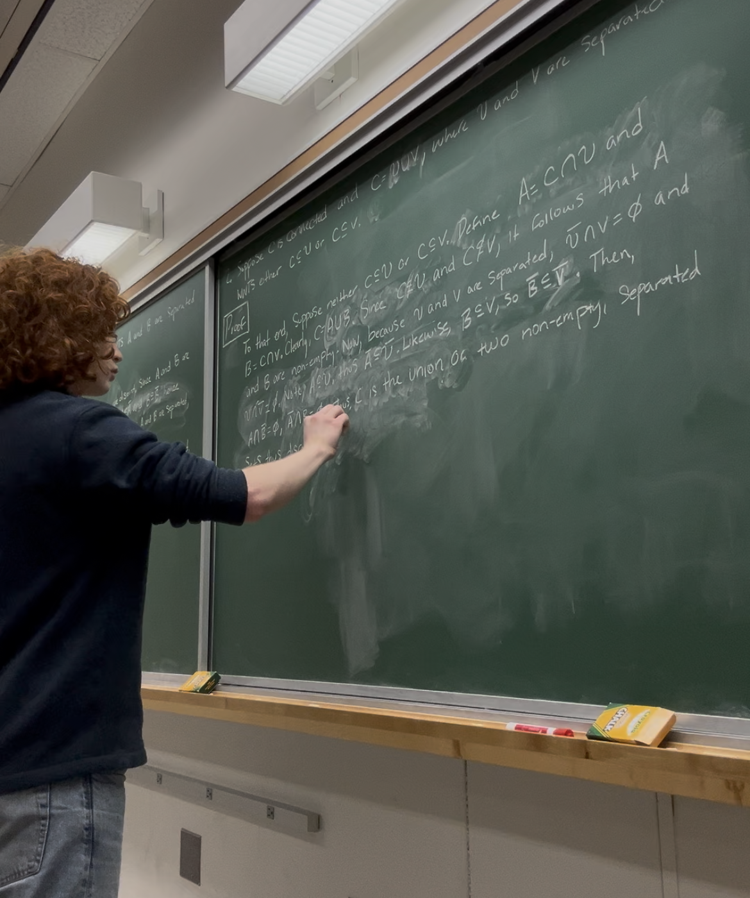

```{=html}
<div style="display:flex; align-items:center; gap:3rem; padding:2rem 5vw; width:100%; box-sizing:border-box; min-height:calc(100vh - 64px);">

  <div style="flex:1; min-width:0;">
    <p>I am an incoming physics PhD student at the University of Delaware. I am completing my undergraduate studies in physics and mathematics at the University of Maryland, Baltimore County.</p>
    <p>My research interests lie broadly in open quantum systems, differential topology, dynamical systems, and mathematical physics. I am especially interested in problems where physical intuition can be sharpened through rigorous mathematical structure.</p>
    <p>I am currently working on problems related to observable dynamics in open quantum systems, with emphasis on coherent and dissipative contributions to quantum speed limits.</p>
    <hr style="border:none; border-top:1px solid #ddd; margin:1.5rem 0;">
    <p>
      <a href="mailto:mjmoody@udel.edu">mjmoody@udel.edu</a><br>
      <a href="https://scholar.google.com/citations?user=XoX463oAAAAJ&hl=en">Google Scholar</a><br>
      <a href="https://github.com/mj-moody">GitHub</a><br>
      <a href="files/cv.pdf">CV</a>
    </p>
  </div>

  <div style="flex-shrink:0; width:35vw; padding-right:4vw; box-sizing:border-box;">
    
  </div>

</div>
```
